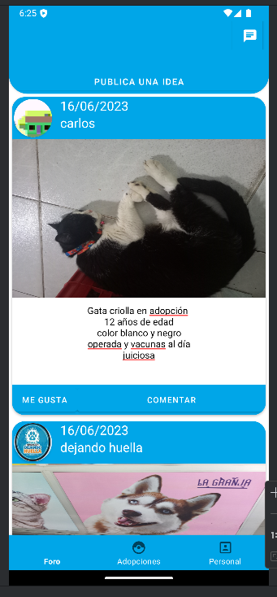
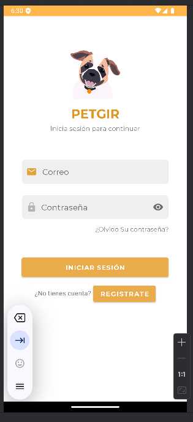
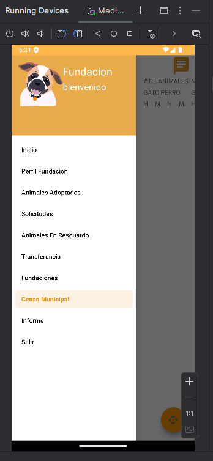
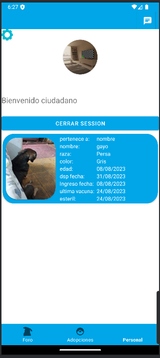

# PetGIR - Sistema de Adopción de Mascotas

**PetGIR** es una aplicación móvil que facilita el proceso de adopción de mascotas, permitiendo a los usuarios ver y adoptar animales disponibles. Desarrollada con Android Studio utilizando Java y Firebase, la aplicación permite a los usuarios gestionar mascotas, crear perfiles, buscar y adoptar mascotas, y recibir notificaciones sobre el estado de las adopciones.

## Características

- **Visualización de Mascotas**: Los usuarios pueden explorar un listado de mascotas disponibles para adopción, con detalles como nombre, edad, raza, y descripción.
- **Creación de Perfil**: Los usuarios pueden crear un perfil de adopción para empezar el proceso de adopción.
- **Adopción de Mascotas**: Facilita el proceso de adopción con opciones para solicitar una adopción de mascota.
- **Notificaciones**: Los usuarios reciben notificaciones sobre el estado de su solicitud de adopción.
- **Gestión de Mascotas**: Los administradores pueden añadir, editar y eliminar mascotas disponibles para adopción.
  
## Funcionalidades

1. **Pantalla de Mascotas Disponibles**
   - Muestra una lista de mascotas disponibles para adopción, con detalles como su nombre, edad, raza, y una breve descripción.
   

2. **Creación de Perfil de Usuario**
   - Los usuarios pueden crear un perfil personal con detalles como nombre, dirección y contacto, necesarios para el proceso de adopción.
   

3. **Formulario de Adopción**
   - Los usuarios pueden solicitar la adopción de una mascota completando un formulario con detalles adicionales.
   

4. **Notificaciones**
   - Los usuarios reciben notificaciones sobre el estado de su solicitud de adopción y otros eventos importantes.
   

5. **Pantalla de Detalles de Mascota**
   - Detalles completos sobre cada mascota, incluyendo más fotos, historia, y requisitos para la adopción.
   

6. **Panel de Administración**
   - Los administradores pueden añadir nuevas mascotas, editar las existentes o eliminarlas.
   

7. **Foro de Adopción**
   - Los usuarios pueden interactuar en el foro, compartir experiencias y recibir consejos sobre el proceso de adopción.
   

8. **Pantalla de Login de Administrador**
   - Los administradores pueden iniciar sesión en su cuenta para gestionar el sistema y realizar funciones administrativas.
   

9. **Menú de Administrador**
   - El menú del administrador incluye accesos rápidos a las funciones principales del sistema, como gestión de usuarios y mascotas.
   

10. **Perfil de Fundación**
    - Los usuarios pueden ver el perfil de la fundación, incluyendo detalles de contacto y misión.
    

11. **Perfil de Usuario**
    - Los usuarios pueden gestionar y actualizar su perfil, incluyendo su información personal y estado de adopción.
    

## Tecnologías

- **Android Studio**: Para el desarrollo de la aplicación móvil.
- **Java**: Lenguaje de programación utilizado para la lógica de la aplicación.
- **Firebase**: Utilizado para la autenticación de usuarios, base de datos en tiempo real, almacenamiento de imágenes y notificaciones push.
- **Firebase Cloud Messaging (FCM)**: Para el envío de notificaciones push a los usuarios.

## Requisitos

- Android Studio 4.1 o superior.
- Conexión a internet para Firebase.
- Cuenta de Firebase para configurar el proyecto.
